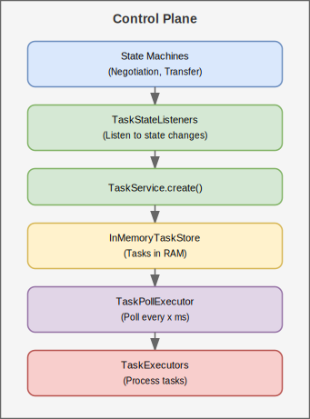
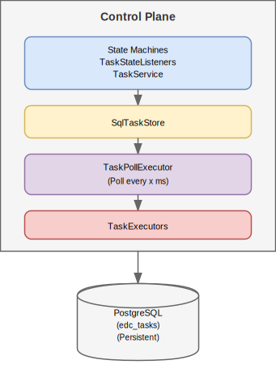
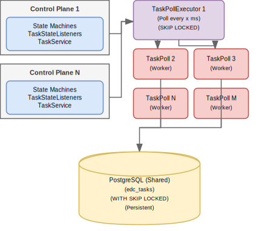
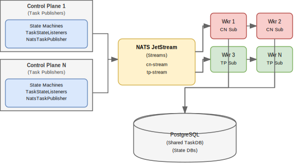

# Task-Based State Machine Architecture

## Table of Contents

1. [Overview](#overview)
2. [Architecture Overview](#architecture-overview)
3. [Task Framework](#task-framework)
4. [Task Lifecycle](#task-lifecycle)
5. [Execution Models](#execution-models)
6. [Task-Based vs CDC-Based](#task-based-vs-cdc-based)
7. [Deployment Scenarios](#deployment-scenarios)
8. [Implementation Details](#implementation-details)
9. [Configuration Reference](#configuration-reference)

---

## Overview

The Virtual-Connector project will implement an experimental **task-based state machine architecture** as an
alternative to current Change Data Capture (CDC) approaches. This architecture introduces **explicit work queue
abstraction** between state transitions and their execution, enabling better decoupling, observability, and scalability.

This document describes the design and first implementation of the task-based state machine architecture, including core
concepts and components. The document may evolve as the implementation matures.

### Motivation

The task-based approach addresses key limitations of CDC-based or entity polling state machines:

- **Decoupling**: State transitions are decoupled from task execution logic
- **Explicit Work Representation**: Tasks are first-class entities that can be persisted, queried, and monitored
- **Flexible Execution Models**: Supports both single-node polling, distributed NATS-based processing and custom models
- **Built-in Retry Logic**: Tasks are automatically retried via timestamp-based scheduling
- **Better Observability**: Task store provides queryable view of pending work
- **Crash Recovery**: Task persistence (with SQL storage) survives control plane restarts

### Architecture Pattern

```
State Transition → StateListener → Task Created → TaskStore/NATS Publisher
                                        ↓
                                   TaskExecutor
                                        ↓
                                   State Update
                                        ↓
                                  (cycle repeats)
```

---

## Architecture Overview

### Core Concepts

The task-based state machine is built on four fundamental concepts:

1. **Tasks**: Explicit work items representing a unit of work to be executed
2. **TaskStore**: Persistent (or in-memory) storage for tasks with concurrency control
3. **TaskExecutors**: Type-specific processors for different task payloads
4. **TaskListeners**: Observers that react to task creation events

### Key Components

#### Task

A generic container for work items with three attributes:

- **id**: Unique identifier (UUID)
- **at**: Timestamp when task should be executed
- **payload**: Type-specific work definition (polymorphic)

Tasks are immutable once created and use Jackson for JSON serialization with external type information.

#### TaskStore

Persistent or in-memory storage layer providing:

- `create(Task)`: Store new task
- `fetchForUpdate(QuerySpec)`: Retrieve tasks ready for execution with pessimistic locking
- `update(Task)`: Update existing task (e.g., for retry)
- `delete(String id)`: Remove completed task
- `findById(String id)`: Retrieve specific task

Implementations:

- **InMemoryTaskStore**: For development and single-instance deployments
- **SqlTaskStore**: For production with PostgreSQL persistence

#### TaskService

Wrapper around TaskStore providing:

- Transaction management
- Observable notification on task creation
- Consistency guarantees

#### TaskObservable/TaskListener

Observer pattern implementation:

- `TaskObservable`: Central registry for task lifecycle listeners
- `TaskListener`: Interface for observers with `created(Task)` callback

This enables loose coupling between task creation and downstream actions (publishing to NATS, logging, etc.).

---

## Task Framework

### Core Entities

#### Task Structure

```java
public class Task {
    protected String id;              // UUID
    protected long at;                // Timestamp (milliseconds)
    protected TaskPayload payload;              // Type-specific payload

    // Methods
    public String getId() { ...}

    public long getAt() { ...}

    public TaskPayload getPayload() { ...}

    public Task.Builder<T> toBuilder() { ...}
}
```

#### TaskPayload Interface

Base interface for all task payloads:

```java
public interface TaskPayload {
    String name();  // Unique identifier: e.g., "negotiation.request.prepare"
}
```

Extended by `ProcessTaskPayload` which adds:

```java
public abstract class ProcessTaskPayload implements TaskPayload {
    protected String processId;       // Negotiation or Transfer Process ID
    protected String processState;    // Current state (INITIAL, REQUESTING, etc.)
    protected String processType;     // CONSUMER or PROVIDER
}
```

### Task Types

Those are the initial task types defined for contract negotiations and transfer processes.
Type and naming conventions may evolve as implementation matures.

#### Contract Negotiation Tasks

Used to drive the contract negotiation state machine through completion:

| Task Type                   | Name                          | Description                    |
|-----------------------------|-------------------------------|--------------------------------|
| RequestNegotiation          | negotiation.request.prepare   | Transition to REQUESTING state |
| SendRequestNegotiation      | negotiation.request.send      | Send ContractRequestMessage    |
| AgreeNegotiation            | negotiation.agree             | Transition to AGREEING state   |
| SendAgreementNegotiation    | negotiation.agreement.send    | Send ContractAgreementMessage  |
| VerifyNegotiation           | negotiation.verify            | Transition to VERIFYING state  |
| SendVerificationNegotiation | negotiation.verification.send | Send verification message      |
| FinalizeNegotiation         | negotiation.finalize          | Transition to FINALIZING state |
| SendFinalizeNegotiation     | negotiation.finalize.send     | Send finalize message          |


#### Transfer Process Tasks

Used to drive transfer process through preparation, startup, suspension, resumption, termination, and completion:

| Task Type             | Name                    | Description                            |
|-----------------------|-------------------------|----------------------------------------|
| PrepareTransfer       | transfer.prepare        | Validate transfer, provision resources |
| SendTransferRequest   | transfer.request.send   | Send transfer request message          |
| StartDataflow         | transfer.start.send     | Signal data plane to start data flow   |
| SignalDataFlowStarted | transfer.started.signal | Receive and process data flow started  |
| SuspendDataFlow       | transfer.suspend        | Suspend active data flow               |
| ResumeDataFlow        | transfer.resume         | Resume suspended data flow             |
| TerminateDataFlow     | transfer.terminate      | Terminate active or pending data flow  |
| CompleteDataFlow      | transfer.complete       | Mark transfer as complete              |

### TaskStore Interface

```java
public interface TaskStore {
    /**
     * Create and persist a new task.
     */
    void create(Task task);

    /**
     * Fetch and lock tasks ready for execution.
     * Uses pessimistic locking to prevent duplicate processing.
     */
    List<Task> fetchForUpdate(QuerySpec querySpec);

    /**
     * Update an existing task (e.g., for retry scheduling).
     */
    void update(Task task);

    /**
     * Delete a completed task.
     */
    void delete(String id);

    /**
     * Retrieve task by ID.
     */
    Task findById(String id);
}
```

**Key Locking Mechanism**:

- `fetchForUpdate()` uses pessimistic locking (transaction-level)
- Prevents multiple workers from processing the same task
- SQL implementation uses database transactions for consistency

---

## Task Lifecycle

### Phase 1: Task Creation from State Transitions

Currently for integrating with upstream EDC, we can detect the state changes via listeners
and create tasks accordingly:

#### ContractNegotiationStateListener

Listens to contract negotiation state changes and creates appropriate tasks:

```java

@Override
public void initiated(ContractNegotiation negotiation) {
    // If consumer:
    // Create RequestNegotiation task to start negotiation flow
    // Store task → triggers TaskObservable → notifies listeners
}

@Override
public void requested(ContractNegotiation negotiation) {
    // If provider: create AgreeNegotiation task
    // If consumer: no action (awaiting counter-party response)
}
```

**State to Task Mapping**:

- INITIATED → RequestNegotiation task (consumer only)
- REQUESTING → SendRequestNegotiation task (consumer only)
- REQUESTED → VerifyNegotiation task (consumer only)
- REQUESTED → AgreeNegotiation task (provider only)
- AGREED → FinalizeNegotiation task (provider only)
- AGREEING → SendAgreementNegotiation task (provider only)
- VERIFYING → SendVerificationNegotiation task (consumer only)
- VERIFIED → FinalizeNegotiation task (provider only)

#### TransferProcessStateListener

Similar pattern for transfer processes:

```java

@Override
public void initiated(TransferProcess process) {
    // Create PrepareTransfer task
    taskService.create(Task.Builder.newInstance()
            .at(System.currentTimeMillis())
            .payload(PrepareTransfer.Builder.newInstance()
                    .processId(process.getId())
                    .processState(process.stateAsString())
                    .processType(process.getType().name())
                    .build())
            .build());
}
```

**State to Task Mapping**:

- INITIATED → PrepareTransfer task (both consumer and provider)
- REQUESTING → SendTransferRequest task (consumer only)
- STARTING → StartDataflow task (provider only)
- STARTING (on protocol request) → StartDataflow task (provider only)
- STARTUP_REQUESTED → SignalDataflowStarted task (consumer only)
- SUSPENDING → SuspendDataFlow task (both consumer and provider)
- SUSPENDING_REQUESTED → SuspendDataFlow task (both consumer and provider)
- TERMINATING → TerminateDataFlow task (both consumer and provider)
- TERMINATING_REQUESTED → TerminateDataFlow task (both consumer and provider)
- COMPLETING → CompleteDataFlow task (both consumer and provider)
- COMPLETING_REQUESTED → CompleteDataFlow task (both consumer and provider)
- RESUMING → ResumeDataFlow task (both consumer and provider)

### Phase 2: Task Storage and Publication

When task is created, `TaskObservable` notifies registered listeners:

#### Option A: NATS Publisher Model (Distributed)

When using NATS JetStream a publisher listener publishes task to NATS
withing the `created()` callback:

```
TaskService.create()
  → TaskObservable.created()
  → Task stored in TaskStore
  → NatsTaskPublisher.created()
  → Publish to NATS JetStream with subject
```

#### Option B: Polling Model (Single Node)

```
TaskService.create()
  → TaskObservable.created()
  → Task stored in TaskStore
  → TaskPollExecutor polls and executes
```

### Phase 3: Task Execution

#### ContractNegotiationTaskExecutor

Handles all contract negotiation task types:

```java
public class ContractNegotiationTaskExecutorImpl
        implements ContractNegotiationTaskExecutor {

    private Map<Class<?>, Handler> handlers = new HashMap<>();

    public StatusResult<Void> handle(ContractNegotiationTaskPayload task) {
        return transactionContext.execute(() -> {
            // 1. Load negotiation from store

            // 2. Validate state matches expected state

            // 3. Validate process type (CONSUMER vs PROVIDER)

            // 4. Check pending guard

            // 5. Execute handler

            return result;
        });
    }

}
```

**Execution Pattern**:

1. Load process entity from store
2. Validate current state matches expected state
3. Validate process type (CONSUMER/PROVIDER)
4. Check pending guards (external dependencies)
5. Execute handler function
6. Handler may create follow-up tasks
7. Return success/failure status

#### Transfer Process Executor

Similar pattern with additional complexity:

- Integrates with `DataFlowController` for data plane coordination
- Handles provisioning operations
- Manages suspension/resumption
- Terminates with cleanup

### Phase 4: Task Completion or Retry

#### Success Path

- Task deleted from TaskStore
- If NATS: Message acknowledged
- Process advances to next state

#### Failure Path

- **Transient Errors**: Task timestamp updated to future time → automatic retry
- **Fatal Errors**: Task deleted, process transitioned to TERMINATED state

**Retry Scheduling**:

```java
private void executeTask(Task task) {
    var result = handleTask(task);
    if (result.succeeded()) {
        taskStore.delete(task.getId());
    } else {
        // Retry: update timestamp for next attempt
        taskStore.update(task.toBuilder()
                .at(clock.millis())  // Current time = immediate retry
                .build());
    }
}
```

---

## Execution Models

Virtual-Connector out-of the box supports two complementary execution models for processing tasks:

### Polling-Based Execution

#### Overview

TaskPollExecutor provides single-threaded polling of TaskStore for simple deployments:

```
Control Plane
  ├─ TaskStore (in-memory or SQL)
  └─ TaskPollExecutor
      └─ Poll every x ms → Execute tasks → Update store
```

#### Implementation

```java
public class TaskPollExecutor {
    private final TaksStore store;


    private void run() {
        transactionContext.execute(() -> {
            try {
                // Fetch the oldest task ready for execution from the store
                // Execute the task
                // If no tasks, sleep for polling interval
                // If execution fails, log error and retry later
            } finally {
                // Schedule next iteration
            }
        });
    }

}
```

#### Characteristics

- **Thread Model**: Single-threaded scheduled executor per node
- **Polling Interval**: (configurable)
- **Batch Size**: 1 task per poll (fetchForUpdate limit=1)
- **State**: Fetches tasks ordered by timestamp ASC (FIFO)
- **Concurrency**:
    - **With SKIP LOCKED**: Multiple workers on same cluster
- **Persistence**: Optional (in-memory or SQL)
- **Distribution**:
    - Single-node (in-memory)
    - Multi-node (SQL with SKIP LOCKED) - **requires database enhancement**

#### Use Cases

✅ **Recommended for**:

- Development and testing
- Single-instance control plane
- Simple deployments without NATS infrastructure
- Debugging and understanding task flow
- Multi-node deployments when NATS is unavailable (with SKIP LOCKED enhancement)

❌ **Not recommended for**:

- Multi-worker deployments without SKIP LOCKED support
- Very high-throughput production scenarios (NATS better)
- Complex distributed architectures (NATS more efficient)

---

### NATS-Based Distribution (Multi-Worker)

#### Overview

Task-based state machine provides true multi-worker support via NATS JetStream:


#### NatsTaskPublisher

Implements `TaskListener` to publish tasks to NATS JetStream:

```java
public class NatsTaskPublisher implements TaskListener {
    private final JetStream js;
    private final ObjectMapper mapper;

    @Override
    public void created(Task task) {
        try {
            // Serialize task to JSON
            var message = mapper.writeValueAsString(task);

            // Publish to NATS with type-based subject
            var subject = formatSubject(task);
            js.publish(subject, message.getBytes());

        } catch (Exception e) {
            throw new EdcException("Failed to publish task", e);
        }
    }

    private String formatSubject(Task task) {
        // Task to subject  mapping logic  
    }
}
```

#### Subject Naming Convention

Tasks are published to hierarchical subjects for targeted routing:

**Contract Negotiations**:

```
negotiations.consumer.negotiation.request.prepare
negotiations.consumer.negotiation.request.send
negotiations.provider.negotiation.agree
negotiations.provider.negotiation.agreement.send
```

**Transfer Processes**:

```
transfers.consumer.transfer.prepare
transfers.consumer.transfer.started.signal
transfers.provider.transfer.start.send
transfers.provider.transfer.complete
```

Pattern: `{domain}.{processType}.{taskName}`

> Subjects hierarchy is subject to change as implementation matures.

#### NatsTaskSubscriber

Base class for all NATS-based task subscribers:

```java
public abstract class NatsSubscriber {
    private final JetStream jetStream;
    private final ExecutorService executor;
    private final AtomicBoolean active = new AtomicBoolean();

    public void start() {
        active.set(true);
        executor.submit(() -> run(subscription));
    }

    private void run(JetStreamSubscription sub) {
        while (active.get()) {
            try {
                // Fetch batch of messages (default: 100)
                var messages = sub.fetch(batchSize, maxWaitMs);

                for (var message : messages) {
                    try {
                        var result = handleMessage(message);
                        if (result.succeeded()) {
                            message.ack();  // Success: acknowledge
                        } else if (result.fatalError()) {
                            message.term();  // Fatal: terminate (don't retry)
                        } else {
                            message.nak();  // Transient: redelivery
                        }
                    } catch (Exception e) {
                        message.nak();  // Exception: redelivery
                    }
                }
            } catch (Exception e) {
                // Subscription error - log and retry
            }
        }
    }

    public void stop() {
        active.set(false);
        executor.shutdown();
    }
}
```

**Implementations**:

1. **NatsContractNegotiationTaskSubscriber**
    - Subscribes to: `negotiations.>`
    - Deserializes and delegates to ContractNegotiationTaskExecutor

2. **NatsTransferProcessTaskSubscriber**
    - Subscribes to: `transfers.>`
    - Deserializes and delegates to TransferProcessTaskExecutor

The subscribers run in separate worker instances, allowing horizontal scaling.
Since we are publishing to NATS in the same transaction as task creation and state transition, subscribers
should check task existence before processing to avoid doing work if the state transition
failed after publishing.

#### Multi-Worker Load Balancing

NATS JetStream provides automatic load distribution via **consumer groups**:

```properties
# All workers use same consumer name → forms consumer group
edc.nats.cn.subscriber.name=cn-subscriber
# NATS automatically distributes messages across workers
# Each message delivered to exactly ONE worker in the group
```

**How it works**:

1. Multiple worker instances connect to same NATS server
2. All use same consumer name → automatically form consumer group
3. Each message published to stream is delivered to one worker
4. Failed/timeout messages are redelivered to available workers
5. Finished workers' unacknowledged messages go to remaining workers

#### Message Acknowledgment Strategy

| Scenario               | Action           | Result                                            |
|------------------------|------------------|---------------------------------------------------|
| Task succeeds          | `message.ack()`  | Message removed from stream, not redelivered      |
| Task fails (transient) | `message.nak()`  | Message immediately redelivered to another worker |
| Task fails (fatal)     | `message.term()` | Message removed, logs written, no retry           |
| Worker crashes         | (timeout)        | Message redelivered to another worker             |

#### Use Cases

✅ **Recommended for**:

- Production deployments with multiple workers
- High-throughput scenarios requiring load distribution
- Distributed architectures (multiple control planes)
- Horizontal scaling by adding worker instances
- Message replay and audit trail requirements

#### Fault Tolerance

- **Worker Crash**: NATS redelivers unacknowledged messages to other workers
- **NATS Broker Down**: Subscriber retries connection, buffered messages in broker
- **Message Loss**: JetStream persistence to disk prevents loss
- **Network Partition**: Redelivery of in-flight messages

---

## Task-Based vs CDC-Based

### CDC-Based Approach (Traditional State Machine)

The CDC (Change Data Capture) model uses store wrappers or complex change detection system and listeners:

```
Store.save(entity)
  → ChangeDetector 
  → ChangeListener invoked
  → Queue messages
  → Background thread polls queue
  → StateMachineService.handle(id, state)
  → State transition
```

### Task-Based Approach (New)

Tasks provide explicit work items:

```
State Transition (via Observable)
  → StateListener.onStateChange()
  → Task created
  → TaskStore.create() + TaskObservable.notified()
  → NatsPublisher OR Polling
  → TaskExecutor.handle()
  → State transition
```

### Detailed Comparison

| Aspect                     | CDC-Based                                        | Task-Based (Polling)                     | Task-Based (NATS)                        |
|----------------------------|--------------------------------------------------|------------------------------------------|------------------------------------------|
| **State Change Detection** | Intercepted in entity save                       | Observable pattern outside store         | Observable pattern outside store         |
| **Work Representation**    | Implicit (state change event)                    | Explicit (Task entity with full payload) | Explicit (Task entity with full payload) |
| **Persistence**            | Change detection only                            | Full task persisted with retry data      | Full task persisted with retry data      |
| **Execution Model**        | Direct call to StateMachineService               | Decoupled TaskExecutor pattern           | Decoupled TaskExecutor pattern           |
| **Retry Logic**            | In-memory queue or Postgres CDC                  | Task timestamp-based, survives crash     | Message NACK-based, persisted on NATS    |
| **Single-Worker**          | Built-in (in-process loopback)                   | TaskPollExecutor                         | N/A (use polling for single)             |
| **Multi-Worker**           | NATS pub/sub (custom)                            | SQL SKIP LOCKED (database-level)         | Native NATS subscribers                  |
| **Observability**          | Event log only                                   | Queryable task store                     | Queryable task store                     |
| **Scalability**            | Limited (state change events) to a single worker | Good with SKIP LOCKED                    | Excellent (message-driven)               |
| **Crash Recovery**         | Postgres CDC wal                                 | Tasks persist in SQL                     | Tasks on NATS stream + SQL               |
| **Audit Trail**            | Events only                                      | Task entities + metadata                 | Task entities + metadata                 |
| **External Dependencies**  | NATS (optional)                                  | PostgreSQL (SQL) or none (in-memory)     | NATS + PostgreSQL                        |

### Key Differences

#### 1. Work Representation

**CDC**: State ID + new state code

```java
// CDC listener notified with minimal data
listener.stateChanged("negotiation-123",REQUESTING);
```

**Task-Based**: Complete task data

```java
// Task contains all context needed for execution
var task = Task.Builder.newInstance()
                .payload(SendRequestNegotiation.Builder.newInstance()
                        .processId("negotiation-123")
                        .processState("REQUESTING")
                        .processType("CONSUMER")
                        .build())
                .build();
```

#### 2. Persistence

**CDC**: Changes are handled with Postgres CDC and WAL mechanism:

- Complexity for managing the replication slot which is also exclusive for one consumer
- Custom PG extensions needed.

**Task-Based**: Persistent tasks

- Tasks remain in store until executed
- Executor crash doesn't lose work
- Natural checkpoint for recovery

#### 3. Routing and Dispatch

- **CDC**: Changes need post-processing to determine next action
- **Task-Based**: Task type directly specifies action needed

#### 4. Decoupling

- **CDC**: Listener tightly coupled to state machine internals
- **Task-Based**: StateListener decoupled from TaskExecutor

---

## Deployment Scenarios

### Scenario 1: Single-Node Development (Polling)

**Use Case**: Development, testing, proof-of-concept

**Architecture**:



**Characteristics**:

- ✅ No external dependencies
- ✅ Easy to develop and debug
- ✅ Fast development cycle
- ❌ Task loss on control plane restart
- ❌ Single worker only

---

### Scenario 2: Single or Multi-Node Production (Polling + SQL with SKIP LOCKED)

**Use Case**: Production control plane(s) with SQL persistence and task-based polling

**Single-Node Architecture**:



**Multi-Node Architecture (with SKIP LOCKED)**:



**Configuration (Single-Node)**:

```properties
# Use SqlTaskStore extension
# PostgreSQL datasource configured via EDC settings
# TaskPollExecutor automatically enabled
```

**Configuration (Multi-Node with SKIP LOCKED)**:

```properties
# All control planes and workers connect to same PostgreSQL
edc.datasource.default.url=jdbc:postgresql://shared-db:5432/edc
edc.datasource.default.user=edc
edc.datasource.default.password=...
# TaskPollExecutor runs on multiple nodes simultaneously
# Database-level locking (SKIP LOCKED) prevents duplicate processing
```

**SQL Schema**:

```sql
CREATE TABLE edc_tasks (
    id VARCHAR PRIMARY KEY,
    name VARCHAR NOT NULL,
    payload JSON DEFAULT '{}',
    timestamp BIGINT NOT NULL,
    CONSTRAINT unique_id UNIQUE (id)
);

CREATE INDEX idx_tasks_timestamp ON edc_tasks(timestamp ASC);
```

**How SKIP LOCKED Works**:

- **FOR UPDATE**: Locks row(s) being fetched
- **SKIP LOCKED**: Skips any rows already locked by other workers
- **Multiple Pollers**: Each poller fetches different tasks (no duplicates)
- **Transaction Scope**: Lock held only during transaction
- **Automatic Release**: Lock released on COMMIT/ROLLBACK

**Characteristics (Single-Node)**:

- ✅ Task persistence across restarts
- ✅ Crash recovery
- ✅ Queryable task history
- ✅ Single control plane
- ❌ Single worker only (without SKIP LOCKED enhancement)
- ❌ Requires PostgreSQL

**Characteristics (Multi-Node with SKIP LOCKED)**:

- ✅ Task persistence across restarts
- ✅ Crash recovery
- ✅ Queryable task history
- ✅ Multiple control planes and workers
- ✅ Automatic load distribution (database-level)
- ✅ No external dependencies (no NATS needed)
- ⚠️ Requires database-level SKIP LOCKED support (PostgreSQL, Oracle, etc.)
- ⚠️ Polling overhead may increase with number of workers
- ❌ Not as efficient as NATS for high-throughput scenarios

**Comparison: Multi-Node Polling (SKIP LOCKED) vs NATS**:

| Aspect                   | Polling + SKIP LOCKED                       | NATS                                           |
|--------------------------|---------------------------------------------|------------------------------------------------|
| **Setup Complexity**     | Low (SQL only)                              | Medium (NATS infrastructure)                   |
| **Infrastructure**       | PostgreSQL (existing)                       | NATS broker + PostgreSQL                       |
| **Load Distribution**    | Database-level                              | Message broker-level                           |
| **Fault Tolerance**      | Worker restart → retries                    | Automatic redelivery to other workers          |
| **Latency**              | Higher (x ms polling)                       | Lower (near-instant delivery)                  |
| **Message Replay**       | No (tasks deleted on success)               | Yes (full NATS stream history)                 |
| **Scalability**          | Good (add workers anytime)                  | Excellent (horizontal scaling)                 |
| **Operational Overhead** | Low                                         | Medium (NATS monitoring)                       |
| **When to Use**          | Small to medium clusters, no NATS available | Large clusters, high throughput, existing NATS |

---

### Scenario 3: Multi-Node Production (NATS + SQL)

**Use Case**: High-availability, high-throughput production

**Architecture**:



**Components**:

1. **Control Planes** (2+):
    - Run state machines
    - Create tasks via TaskStateListeners
    - Publish tasks to NATS
    - Use shared PostgreSQL for state

2. **NATS Broker**:
    - Hosts JetStream streams
    - `cn-stream` for contract negotiation tasks
    - `tp-stream` for transfer process tasks
    - Persists messages to disk

3. **Worker Nodes** (2+):
    - Run NatsTaskSubscriber instances
    - Form consumer group (load distribution)
    - Execute tasks via TaskExecutor
    - Report results to NATS (ACK/NAK/TERM)

4. **Shared PostgreSQL**:
    - State database (contracts, transfers)
    - TaskStore for recovery
    - Visible to all control planes and workers

**Characteristics**:

- ✅ Multi-node deployment
- ✅ Automatic load balancing via NATS
- ✅ Horizontal scaling (add workers anytime)
- ✅ Task persistence
- ✅ Crash recovery
- ✅ High availability
- ✅ Message replay capability
- ❌ Requires NATS infrastructure
- ❌ Network dependencies
- ❌ More complex setup

---
